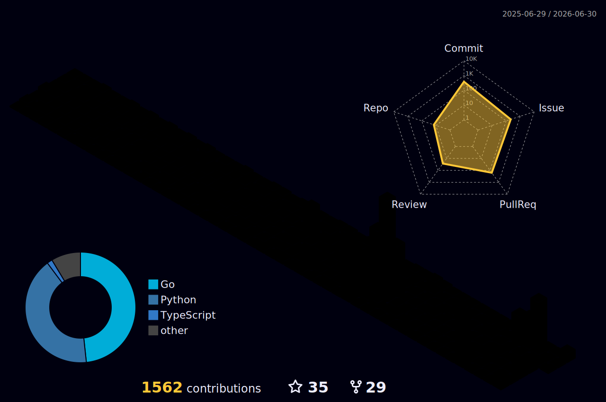

<!-- 
  ╔═══════════════════════════════════════════════════════════════════════════╗
  ║  Hey, you're reading the source. I respect that.                          ║
  ║  Here's a secret: I believe the best code is the code you don't write.    ║
  ║  That's why I build agents to write it for me.                            ║
  ╚═══════════════════════════════════════════════════════════════════════════╝
-->

<div align="center">

[](https://github.com/NP-compete/NP-compete)
[](https://github.com/NP-compete)

### *"I automate myself out of jobs, then find harder problems."*

<a href="https://git.io/typing-svg">
  
</a>

<br>


</div>

---

## `> whoami`

```python
class Soham:
    """I build agents so I never have to do the same thing twice."""
    
    role = "Senior Software Engineer @ Red Hat"
    background = "Site Reliability Engineering"
    building = "Data agents, research agents, infra agents"
```

---

## `> cat toolbox.yaml`

```yaml
agents_and_ai:
  - LangGraph | LangChain | MCP Protocol | Langfuse
  - Gemini / Claude / GPT | RAG Pipelines

infrastructure:
  - Kubernetes | OpenShift | Terraform | Ansible | Docker

observability:
  - OpenTelemetry | Prometheus | Grafana | Splunk

languages:
  - Python | Go | Bash

databases:
  - PostgreSQL | Snowflake | Redis | MongoDB | Elasticsearch
```

---

## `> tail -5 blog.log`

**From [The Opinionated SRE](https://soham.super.site/blogs):**
- [Let My People Go!](https://soham.super.site/blogs)
- [Creating ngrok on my local system](https://soham.super.site/blogs)
- [Everything is broken, and it's okay](https://soham.super.site/blogs)
- [Understanding Trust in Your Infrastructure](https://soham.super.site/blogs)

**From [Medium](https://medium.com/@mr-right):**
<!-- BLOG-POST-LIST:START -->
- [Kata Containers boost security in Docker containers](https://medium.com/@mr-right)
- [Build your very own OpenStack Lab](https://medium.com/@mr-right)
- [Introduction to OpenStack](https://medium.com/@mr-right)
- [What's new in Python 3.8?](https://medium.com/@mr-right)
- [A friendly introduction to Quantum Computing](https://medium.com/@mr-right)
<!-- BLOG-POST-LIST:END -->

---

## `> git log --oneline -1 stats`

<div align="center">


<br>



<br>

<picture>
  <source media="(prefers-color-scheme: dark)" srcset="https://raw.githubusercontent.com/NP-compete/NP-compete/output/snake-dark.svg" />
  <source media="(prefers-color-scheme: light)" srcset="https://raw.githubusercontent.com/NP-compete/NP-compete/output/snake.svg" />
  
</picture>

</div>

---

## `> ping soham`

<div align="center">

<a href="https://www.linkedin.com/in/sohamdutta/">
  
</a>
<a href="https://soham.super.site/">
  
</a>
<a href="mailto:soham.dutta.devops@gmail.com">
  
</a>
<a href="https://github.com/NP-compete">
  
</a>

**Building something interesting?** Let's talk.

</div>

---

<div align="center">

<sub>This README was crafted with care, not generated by AI. Okay, maybe a little AI. Fine, a lot of AI. I build agents, remember?</sub>

<br><br>

[](https://github.com/NP-compete/NP-compete)

</div>
